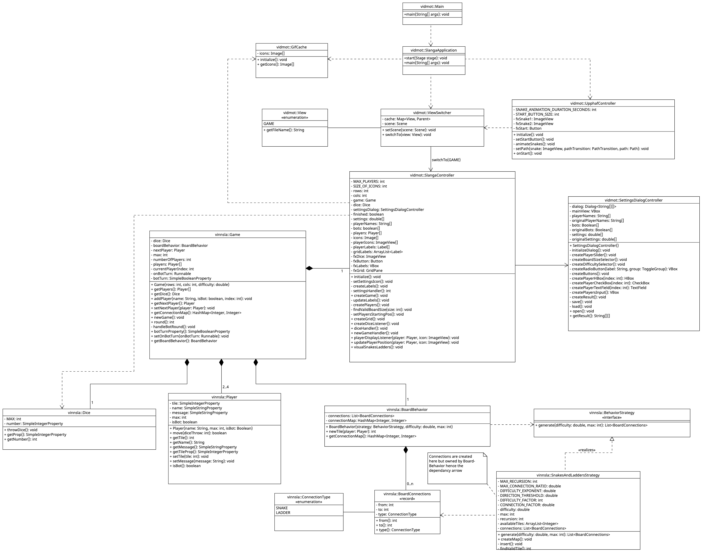

# Design

### UML
The **class diagram** is as follows:

### Design patterns
This project uses **2** classic design patterns.
##### Observer pattern
The first one is the **Observer** pattern, which was already implemented into the
project. It allows the user interface to react to changes in the game model 
(which stores and manages data) without being tightly coupled to the logic itself. This is shown in class 
[SlangaController](../../../src/main/java/vidmot/SlangaController.java) where player icons are
automatically updated when the associated Player object changes position
using a listener.

##### Strategy pattern
The other pattern that was implemented is the **Strategy** pattern. It is used in the
[vinnsla](../../../src/main/java/vinnsla) package. [BoardBehavior](../../../src/main/java/vinnsla/BoardBehavior.java)
takes a [BehaviorStrategy](../../../src/main/java/vinnsla/BehaviorStrategy.java) as a parameter,
which is an interface implemented by [SnakesAndLaddersStrategy](../../../src/main/java/vinnsla/SnakesAndLaddersStrategy.java).
This seperates the board logic from the snakes-and-ladders algorithm,
making [BoardBehavior](../../../src/main/java/vinnsla/BoardBehavior.java) easily extendable with new strategies in the future.